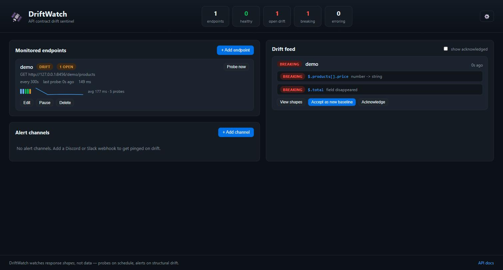

# 🛰️ DriftWatch

> **Self-hosted API contract drift sentinel** — watch the third-party JSON APIs
> your app depends on and get alerted the moment their response *shape* changes,
> before your production code finds out the hard way.

[](https://github.com/manijose1919/driftwatch/actions/workflows/ci.yml)
[](LICENSE)
[](https://www.python.org/)
[](https://fastapi.tiangolo.com/)

DriftWatch probes each API you register on a schedule, reduces every response to
a structure-only **type-shape**, and alerts on Discord/Slack/email/webhook when
that shape drifts — classifying each change as 🔴 breaking, 🟡 risky, or 🟢 benign
from the *consumer's* point of view. Zero-cost, one process, no Node toolchain.



## Contents

- [The problem it solves](#the-problem-it-solves) · [Who it's for](#who-its-for) · [How it works](#how-it-works)
- [Quick start](#quick-start) · [Alert channels](#alert-channels) · [Configuration](#configuration-environment-variables)
- [REST API](#rest-api) · [Tests](#tests) · [Project layout](#project-layout) · [Design decisions](#design-decisions)

## The problem it solves

Teams routinely integrate third-party REST APIs that are not Stripe-grade:
shipping rate APIs, niche SaaS endpoints, government open-data feeds, market
data providers. These APIs silently change their payloads — a field
disappears, `"price": 12.5` becomes `"price": "12.50"`, an enum grows a new
value, a field starts returning `null` — with no version bump, no changelog,
no deprecation notice. The consuming team finds out when production breaks,
or worse, when data corrupts quietly for weeks.

Existing tools don't fit this niche:

- **Contract testing (Pact)** requires the *provider's* cooperation — you
  don't get that from a third party.
- **Synthetic monitoring (Datadog, Checkly)** checks uptime and status codes,
  not response *shape*, and the good tiers are paid.
- **Hand-written JSON schema checks** rot immediately because nobody updates
  them.

DriftWatch is a permanent, zero-cost early-warning system that turns
"production broke at 2 AM" into "you got a ping three days before the deploy
that would have broken."

## Who it's for

- **Backend/full-stack developers** integrating third-party or internal APIs
  they don't control.
- **Small teams and solo builders** who can't justify enterprise API
  observability pricing but still get burned by silent payload changes.
- **Platform/infra folks** who want a self-hosted watchdog for the API
  contracts between internal services.

## How it works

DriftWatch probes each registered endpoint on a schedule and converts the
JSON response into a **type-shape**: a structure-only signature capturing
types, object fields, array item shapes, optionality, nullability, and
enum candidates — while deliberately discarding the actual values. Changing
*data* never fires an alarm; only changing *structure* does.

```
schedule ──► probe endpoint ──► infer type-shape ──► diff vs learned baseline
                                                            │
                   dashboard feed ◄── drift event ◄── classify changes
              Discord/Slack/email ◄──┘
```

Each change is classified from the **consumer's** point of view:

| Severity | Meaning | Examples |
|---|---|---|
| 🔴 **breaking** | client code will very likely fail | field removed · type changed · value now always null |
| 🟡 **risky** | may fail depending on assumptions | new enum value · field became nullable/optional · int → float |
| 🟢 **benign** | purely additive | new field · array item shape learned |

Observations *consistent* with the baseline are silent by design: an optional
field being absent, one variant of a union type, an empty array, or a
nullable field holding a value are sampling outcomes, not drift.

### Learned baselines

A new endpoint enters a **learning phase**: its first N probes
(`DRIFTWATCH_BASELINE_PROBES`, default 3) merge into the baseline, so
intermittent/optional fields and enum values are captured before drift
detection arms. Accepting a drifted shape as the new baseline re-enters
learning the same way.

### Noise controls

- **Duplicate suppression** — persisting drift alerts once, not every probe.
- **Edge-triggered errors** — one alert when an endpoint starts failing, not
  one per probe while it stays down.
- **Retry with backoff** — network errors and 5xx are retried
  (`DRIFTWATCH_PROBE_RETRIES`, default 2) before an endpoint is marked
  erroring.
- **Retention pruning** — acknowledged events and orphaned snapshots older
  than `DRIFTWATCH_RETENTION_DAYS` (default 30) are pruned daily; open drift
  is never pruned.

## Quick start

```powershell
# Windows
.\start.ps1 -Port 8420
```

```bash
# anywhere with Python 3.12+
python -m venv .venv && .venv/bin/pip install -r requirements.txt
.venv/bin/uvicorn app.main:app --port 8420
```

Open **http://127.0.0.1:8420/** for the dashboard, `/docs` for the REST API.

### Try it in 60 seconds (built-in demo API)

1. In the dashboard, add an endpoint with URL `http://127.0.0.1:8420/demo/products`.
2. Probe it three times (or wait) — watch it go `learning → ok`.
3. Break the demo API: `POST /demo/scenario/1` (price becomes a string, a field disappears).
4. Click **Probe now** → a 🔴 breaking event appears with exact JSON paths.
5. Click **View shapes** for a side-by-side baseline vs observed comparison,
   and **Accept as new baseline** when a change is intentional.

Scenarios: `0` baseline · `1` breaking · `2` risky · `3` benign.

### Run at logon (Windows)

```powershell
.\install-autostart.ps1 -Port 8420    # registers a Scheduled Task (starts now + at logon)
.\uninstall-autostart.ps1             # removes it
```

### Docker

```bash
docker build -t driftwatch .
docker run -p 8080:8080 -v driftwatch-data:/data driftwatch
```

## Alert channels

Add channels in the dashboard; each has its own minimum severity threshold.

| Kind | Target | Notes |
|---|---|---|
| Discord | webhook URL | free, no OAuth — Server Settings → Integrations → Webhooks |
| Slack | webhook URL | incoming webhook |
| Generic webhook | any URL | receives `{"text": ..., "source": "driftwatch"}` |
| Email | recipient address | requires the SMTP env vars below |

## Configuration (environment variables)

| Variable | Default | Purpose |
|---|---|---|
| `DRIFTWATCH_DB` | `sqlite:///./driftwatch.db` | SQLAlchemy database URL |
| `DRIFTWATCH_API_TOKEN` | *(empty = auth off)* | Bearer token required on `/api/*`; set it in the dashboard via ⚙️ |
| `DRIFTWATCH_SCHEDULER_ENABLED` | `true` | disable to probe manually only |
| `DRIFTWATCH_BASELINE_PROBES` | `3` | probes merged into a new baseline before drift detection arms |
| `DRIFTWATCH_PROBE_TIMEOUT` | `15` | per-probe HTTP timeout (seconds) |
| `DRIFTWATCH_PROBE_RETRIES` | `2` | extra attempts on network error / 5xx |
| `DRIFTWATCH_PROBE_BACKOFF` | `0.5` | seconds between retries (linear) |
| `DRIFTWATCH_RETENTION_DAYS` | `30` | prune acknowledged events/snapshots after N days (0 = keep forever) |
| `DRIFTWATCH_SMTP_HOST` | *(empty = email off)* | SMTP server for email channels |
| `DRIFTWATCH_SMTP_PORT` | `587` | SMTP port |
| `DRIFTWATCH_SMTP_USER` / `DRIFTWATCH_SMTP_PASSWORD` | *(empty)* | SMTP login (optional) |
| `DRIFTWATCH_SMTP_FROM` | `driftwatch@localhost` | From address |
| `DRIFTWATCH_SMTP_STARTTLS` | `true` | issue STARTTLS before auth |

## REST API

Everything the dashboard does is plain REST (see `/docs` for the full
OpenAPI spec):

- `POST /api/endpoints` · `GET /api/endpoints` · `PUT/DELETE /api/endpoints/{id}`
- `POST /api/endpoints/{id}/probe` — probe now
- `GET /api/endpoints/{id}/history` — per-probe latency + status time series (powers the dashboard sparkline)
- `GET /api/events` · `POST /api/events/{id}/ack` · `POST /api/events/{id}/accept`
- `GET /api/events/{id}/shapes` — baseline vs observed shape for an event
- `POST /api/channels` · `POST /api/channels/{id}/test`
- `GET /api/stats`
- `GET /healthz` — unauthenticated liveness/readiness probe (200 healthy, 503 if the DB is unreachable); used by the Docker `HEALTHCHECK` and any uptime monitor

## Tests

```powershell
.venv\Scripts\pip install -r requirements-dev.txt   # runtime + test/lint tools
.venv\Scripts\python -m pytest tests -q             # 67 tests
```

Covers shape inference, the drift classifier's severity semantics, baseline
learning, retry behavior, retention pruning, alert dispatch/filtering, the
`/healthz` probe, per-probe metrics + `/history`, and the full
probe → drift → alert → accept lifecycle over the REST API. Every push and PR runs this suite in GitHub Actions
(`.github/workflows/ci.yml`).

## Project layout

```
app/
  main.py          FastAPI app: routers, static dashboard, lifespan
  config.py        env-based settings
  database.py      SQLAlchemy engine/session + lightweight SQLite migrations
  models.py        Endpoint, Snapshot, DriftEvent, ProbeResult, AlertChannel
  schemas.py       Pydantic request/response models
  auth.py          optional bearer-token guard
  scheduler.py     APScheduler: one interval job per endpoint + daily pruning
  alerts.py        webhook + SMTP alert dispatcher
  retention.py     retention pruning
  engine/
    shape.py       JSON -> type-shape inference
    differ.py      shape diff + severity classifier
    prober.py      probe executor (fetch w/ retries, learn, diff, record)
  routes/
    endpoints.py   endpoint CRUD + probe-now + snapshots
    drift.py       drift feed, ack, accept-baseline, shapes, stats
    channels.py    alert channel CRUD + delivery test
    demo.py        built-in mutable demo API
    health.py      unauthenticated /healthz liveness/readiness probe
static/            zero-build dashboard (vanilla JS SPA)
tests/             pytest suite (67 tests)
```

## Design decisions

- **Shapes, not data** — diffing inferred type-shapes makes the
  signal-to-noise ratio nearly perfect, which is the entire reason a tool
  like this gets trusted rather than muted.
- **SQLite, one process** — probes write one small row at a time; removing
  the database server makes self-hosting mean `docker run` or one PowerShell
  script, not a compose stack with credentials.
- **Zero-build frontend** — the dashboard is vanilla JS served by the same
  FastAPI process. No Node toolchain, nothing to compile, one deployable.

## Contributing

Contributions are welcome. The whole app is one FastAPI process with a SQLite
database and a vanilla-JS dashboard, so getting started is quick — see
[CONTRIBUTING.md](CONTRIBUTING.md) for the dev setup, test command, and the few
conventions worth knowing. Every push and PR runs the test suite in CI.

## License

Released under the [MIT License](LICENSE).
